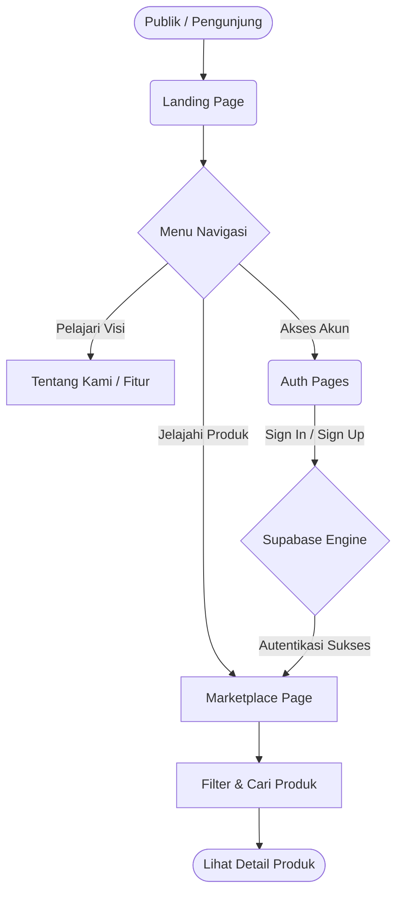
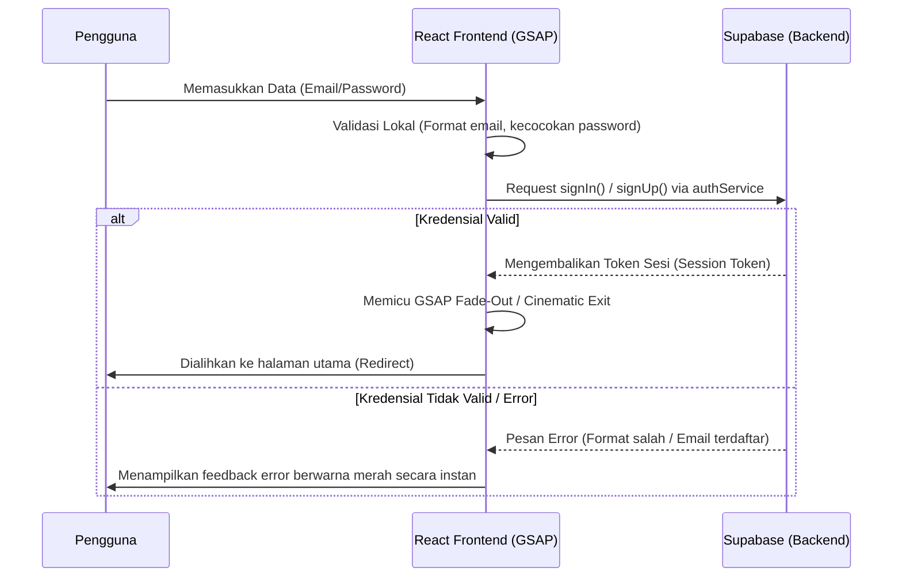

# BumiLestari

[](https://reactjs.org/)
[](https://www.typescriptlang.org/)
[](https://vitejs.dev/)
[](https://greensock.com/)
[](https://tailwindcss.com/)
[](https://supabase.com/)

> Platform gaya hidup berkelanjutan dan *e-commerce* premium, dibangun dengan pendekatan antarmuka "Awwwards-style" yang sinematik dan mendalam.

---

## Docker Repository
Proyek ini tersedia dalam kontainer Docker:
**[Link Docker Repository BumiLestari](https://hub.docker.com/repository/docker/nottpsychoo/bumilestari/general)**

---

## Deskripsi Proyek

**BumiLestari** adalah sebuah platform digital yang menggabungkan kampanye gaya hidup ramah lingkungan dengan pengalaman *marketplace* premium. Berbeda dengan aplikasi *e-commerce* standar (berbasis *template*), aplikasi ini dirancang secara khusus (*custom-built*) dengan menonjolkan:
- **Cinematic Experience:** Memanfaatkan pustaka animasi industri standar (GSAP) untuk transisi halaman yang elegan, pembukaan layar (*curtain reveal*), dan parallax latar belakang.
- **Premium Minimalist E-Commerce:** Grid produk yang tajam (rasio 4:5), interaksi melayang (*hover*), dan susunan sidebar lengket (*sticky sidebar*) tanpa bergantung pada kotak bayangan (*box-shadow*) murahan.
- **Micro-Interactions:** Integrasi kursor kustom (*custom cursor*) dan tombol magnetik untuk meningkatkan keterlibatan interaktif pengguna.

---

## Tech Stack Utama

Proyek ini dibangun menggunakan teknologi Front-End modern dengan dukungan *Backend as a Service* yang sangat terukur.

*   **Inti:** React (diinisialisasi melalui Vite), TypeScript (Strict Mode).
*   **Styling:** Tailwind CSS (dikombinasikan dengan Vanilla CSS kustom untuk presisi tinggi).
*   **Animation Engine:** GSAP (GreenSock Animation Platform) + `@gsap/react`, didukung dengan *Framer Motion* untuk interaksi transisi skala kecil.
*   **Routing:** React Router DOM (v6+).
*   **Backend & Database:** Supabase (Autentikasi Pengguna & Integrasi API Data).
*   **Ikonografi:** Lucide React.

---

## Struktur Direktori

Kode sumber difokuskan pada pemisahan yang jelas antara komponen antarmuka, tata letak halaman, dan logika layanan.

```text
bumilestari/
├── public/                 # Aset publik statis (Logo, background statis)
├── src/
│   ├── components/         # Direktori pusat komponen UI
│   │   ├── container/      # Komponen makro (Hero Section, About Section, dll)
│   │   └── ui/             # Komponen mikro/reusable (CustomCursor, SearchBar, ProductCard)
│   ├── lib/                # Logika koneksi Database & API
│   │   ├── auth.ts         # Layanan Autentikasi Supabase
│   │   ├── productService.ts # Layanan Pengambilan Data Produk
│   │   └── supabase.ts     # Inisialisasi Klien Supabase
│   ├── pages/              # Komponen level Halaman (Routes)
│   │   ├── LandingPage.tsx   # Halaman beranda utama dengan Parallax
│   │   ├── MarketplacePage.tsx # Halaman belanja dengan Sticky Sidebar
│   │   ├── LoginPage.tsx     # Halaman masuk (GSAP Cinematic Auth)
│   │   └── RegisterPage.tsx  # Halaman pendaftaran
│   ├── utils/              # Fungsi utilitas (Logger analitik, formatters)
│   ├── App.tsx             # Pengatur Routing Utama
│   ├── index.css           # Direktif Tailwind & Variabel CSS Kustom
│   └── main.tsx            # Titik masuk aplikasi (Entry Point)
├── .env.local              # Environment variables (Supabase Keys)
├── tailwind.config.js      # Konfigurasi token desain Tailwind
├── tsconfig.json           # Aturan kompilasi TypeScript
└── package.json            # Daftar dependensi & script runner
```

---

## System Architecture & Routing Flow

Diagram berikut mengilustrasikan bagaimana pengguna bernavigasi dari halaman arahan (Landing Page) menuju halaman pembelanjaan (Marketplace) dan sistem autentikasi.



---

## Authentication Workflow

Kami telah merombak total sistem autentikasi dari *form* generik menjadi pengalaman *borderless* tanpa *scroll*. Di balik antarmukanya, komunikasi ke *backend* diatur dengan alur berikut:



---

## Panduan Instalasi (How to Run Locally)

Ikuti langkah-langkah di bawah ini untuk menjalankan proyek BumiLestari secara lokal di mesin Anda.

### 1. Kloning Repositori
```bash
git clone https://github.com/username-anda/bumilestari.git
cd bumilestari
```

### 2. Instalasi Dependensi
Pastikan Anda memiliki `Node.js` (versi 18.x atau lebih baru) yang sudah terinstal.
```bash
npm install
```

### 3. Konfigurasi Environment Variables
Buat sebuah file bernama `.env.local` di *root* direktori (sejajar dengan `package.json`), lalu masukkan kunci koneksi Supabase Anda:
```env
VITE_SUPABASE_URL=https://[PROJECT_ID].supabase.co
VITE_SUPABASE_ANON_KEY=ey...[ANON_KEY]...
```

### 4. Jalankan Development Server
```bash
npm run dev
```
Setelah berjalan, buka browser Anda dan akses: `http://localhost:5173`

### 5. Kompilasi & Build (Opsional)
Untuk memastikan tidak ada kesalahan TypeScript dan membuat bundel produksi:
```bash
npm run build
```

---