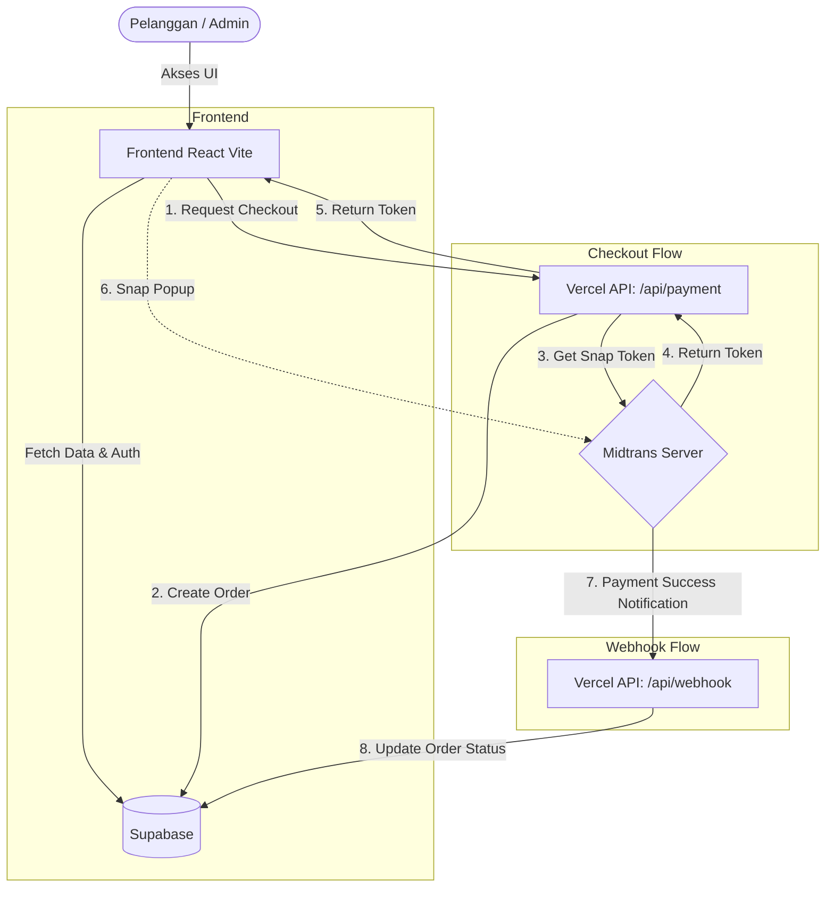
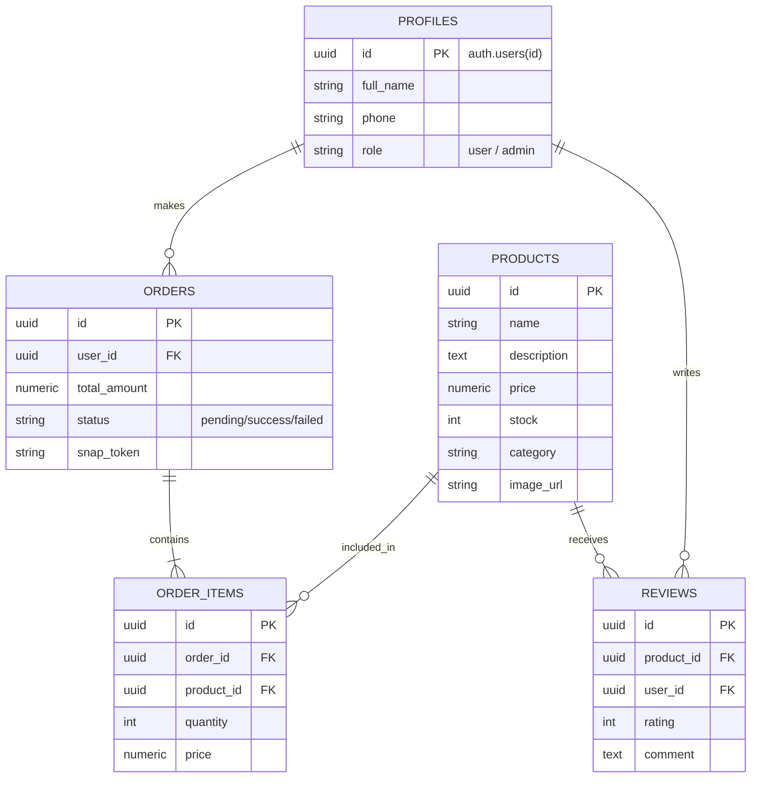

# BumiLestari


BumiLestari adalah platform E-Commerce (Marketplace) modern yang didedikasikan untuk mendukung gaya hidup berkelanjutan dan ramah lingkungan. Platform ini memungkinkan pengguna untuk membeli berbagai produk ekologis, dan menyediakan *dashboard* pengelolaan bagi admin untuk mengatur stok barang serta melacak pesanan pelanggan secara *real-time*.

---

## Tech Stack

**Frontend**
*   **Framework**: React 18
*   **Build Tool**: Vite
*   **Language**: TypeScript (Strict Mode)
*   **Styling**: Tailwind CSS, Vanilla CSS
*   **Animations**: GSAP (GreenSock)
*   **Icons**: Lucide React

**Backend & Infrastructure**
*   **BaaS (Backend-as-a-Service)**: Supabase (PostgreSQL, Auth, Storage)
*   **Serverless Environment**: Vercel Functions (`/api` directory)
*   **Payment Gateway**: Midtrans (Snap API & Webhooks)
*   **Hosting**: Vercel

---

## System Architecture

Diagram berikut menjelaskan bagaimana interaksi antara sisi klien (Frontend), serverless API (Vercel), Payment Gateway (Midtrans), dan Database (Supabase).



---

## Entity Relationship Diagram (ERD)

Skema database PostgreSQL di Supabase dirancang untuk mendukung sistem *e-commerce* dengan relasi tabel yang kokoh.



---

## Struktur Direktori

```text
BumiLestari/
├── api/                   # Vercel Serverless Functions
│   ├── payment.ts         # Men-generate Token Snap Midtrans
│   └── webhook.ts         # Menerima notifikasi otomatis dari Midtrans
├── src/
│   ├── components/        # Reusable React Components
│   │   ├── admin/         # Modals & Forms khusus Admin
│   │   ├── container/     # Layout section untuk Landing Page
│   │   └── ui/            # Komponen dasar (Navbar, Footer, Button, Card)
│   ├── lib/               # Service Layer & Supabase Clients
│   │   ├── admin.ts       # Service CRUD Produk Admin
│   │   ├── auth.ts        # Service Autentikasi User
│   │   ├── orders.ts      # Service Logika Pesanan & Checkout
│   │   ├── products.ts    # Service Katalog Publik
│   │   └── supabase.ts    # Inisialisasi DB & Definisi Tipe Data (Interface)
│   ├── pages/             # Route Halaman (Home, Marketplace, Admin, Payment, Orders)
│   ├── types/             # Deklarasi Tipe Global (midtrans.d.ts)
│   ├── utils/             # Fungsi Utilitas (Logger, Formatters)
│   ├── App.tsx            # Konfigurasi React Router
│   └── index.css          # Entri utama Tailwind & Global CSS
├── vercel.json            # Konfigurasi Routing Serverless Vercel
└── vite.config.ts         # Konfigurasi Build Tools Vite
```

---

## Penjelasan Fitur

### Sisi Pelanggan (User)
*   **Otentikasi Aman**: Registrasi, Login, dan manajemen profil yang terintegrasi dengan Supabase Auth.
*   **Katalog Interaktif**: Eksplorasi produk ramah lingkungan dengan dukungan filter, pencarian, dan *sorting* yang dinamis.
*   **Ulasan & Rating**: Pelanggan dapat memberikan dan membaca ulasan (bintang 1-5) dari pembeli lain untuk setiap produk.
*   **Checkout & Pembayaran (Midtrans Integration)**: Pembayaran *seamless* melalui *Midtrans Snap Popup*. Mendukung transfer bank, e-wallet, dan QRIS.
*   **Pelacakan Pesanan**: Pelanggan memiliki halaman khusus (`/orders`) untuk melacak riwayat transaksi (Berhasil, Gagal, atau Menunggu Pembayaran) dan melanjutkan pembayaran yang tertunda.
*   **Responsif & Animasi Halus**: UI/UX yang elegan menggunakan warna alam (*earth tones*), serta navigasi menu interaktif yang dianimasikan menggunakan *GSAP*.

### Sisi Pengelola (Admin)
*   **Role-Based Access**: Akses khusus untuk Admin yang dilindungi dengan *Row Level Security* (RLS) di level database.
*   **Dashboard Statistik**: Ringkasan total pendapatan, total pesanan, dan jumlah pelanggan yang aktif.
*   **Manajemen Inventaris**: Fitur CRUD (*Create, Read, Update, Delete*) lengkap untuk menambah, mengubah informasi stok/harga, hingga menghapus produk. Termasuk *upload* gambar ke Supabase Storage.
*   **Manajemen Pesanan**: Pemantauan pesanan pelanggan dari seluruh Indonesia dengan fitur validasi dan *update* status pesanan manual maupun otomatis.

---

## Komponen yang Digunakan

Proyek ini dibangun menggunakan arsitektur komponen yang sangat modular dan fleksibel. Berikut adalah komponen-komponen penyusun aplikasi ini:

### 1. Komponen UI Global (`src/components/ui/`)
*   **`Navbar.tsx` & `StaggeredMenu.tsx`**: Komponen navigasi atas dan menu *hamburger* yang sepenuhnya dianimasikan dengan GSAP. Menyediakan navigasi berdasarkan peran (User vs Admin).
*   **`Footer.tsx`**: Bagian bawah halaman yang berisi informasi navigasi, *newsletter*, dan kontak perusahaan.
*   **`ProductCard.tsx`**: Komponen kartu produk *reusable* yang menampilkan foto barang, harga, nama, dan tombol akses cepat.
*   **`Filter.tsx` & `SortDropdown.tsx`**: Komponen kendali antarmuka bagi pengguna untuk menyaring produk berdasarkan kategori dan harga.

### 2. Komponen Interaksi Spesifik (`src/components/ui/`)
*   **`ReviewSection.tsx`**: Mengelola dan me-render *feedback* produk dari pelanggan. Komponen ini langsung berinteraksi dengan API Supabase untuk penulisan *review* baru.
*   **`ProductInfo.tsx`**: Menampilkan detail lengkap suatu produk ketika di-klik dari katalog, lengkap dengan spesifikasi barang dan ketersediaan stok.

### 3. Komponen Dasbor Admin (`src/components/admin/`)
*   **`AddProductModal.tsx`**: *Modal dialog* bagi admin untuk memasukkan data dan gambar produk baru ke dalam sistem. Memiliki validasi *form* bawaan.
*   **`EditProductModal.tsx`**: Serupa dengan komponen penambahan, namun secara dinamis menarik data spesifik produk untuk diedit tanpa merusak status gambar yang sudah ada (jika tidak diubah).

### 4. *Service Layer* & Integrasi API (`src/lib/`)
*   **`supabase.ts`**: *Entry-point* klien Supabase dan deklarasi antarmuka (TS Interface) utama yang memetakan seluruh skema *Database SQL* (`Order`, `Product`, `Review`, `Profile`).
*   **`orders.ts`**: Lapisan abstrak yang menangani segala pemrosesan transaksi. Di sinilah letak logika relasional pemanggilan API *Midtrans* dan penyelarasan status `Order` dengan Supabase.
*   **`products.ts` & `admin.ts`**: Mengisolasi pemanggilan CRUD spesifik sehingga kode antarmuka (React) terbebas dari *query* database secara langsung.

---

## Integrasi Pembayaran Midtrans (Serverless Vercel)

Aplikasi ini menggunakan perpaduan unik antara **Vite React Frontend** dan **Vercel Serverless Functions**:

1.  **Serverless API (`api/payment.ts`)**: Saat pengguna menekan "Bayar", React memanggil API lokal ini. API bertugas secara rahasia untuk menghubungi server Midtrans menggunakan **Server Key**.
2.  **Snap JS Injection**: *Token* balasan dari Midtrans diinjeksi ke frontend melalui *type-safe global augmentation* `window.snap.pay()`.
3.  **Webhook (`api/webhook.ts`)**: Titik akhir (*endpoint*) asinkron yang mendengarkan perubahan dari server Midtrans (misalnya saat pelanggan berhasil transfer via ATM) untuk memperbarui status pesanan menjadi `success` secara terpusat di database.

---

## Instalasi & Konfigurasi Lokal

Untuk menjalankan aplikasi ini secara lokal, ikuti langkah-langkah di bawah:

### Prasyarat
*   Node.js (versi 18+)
*   Akun [Supabase](https://supabase.com)
*   Akun [Midtrans Sandbox](https://midtrans.com)
*   Vercel CLI (Direkomendasikan untuk testing *Serverless API*)

### Langkah-langkah
1.  **Kloning Repositori**
    ```bash
    git clone https://github.com/your-username/BumiLestari.git
    cd BumiLestari
    ```

2.  **Instalasi Dependensi**
    ```bash
    npm install
    ```

3.  **Pengaturan Variabel Lingkungan**
    Buat file `.env.local` pada *root directory* dan isi dengan kredensial milik Anda:
    ```env
    # Supabase Keys
    VITE_SUPABASE_URL=https://proyek-anda.supabase.co
    VITE_SUPABASE_ANON_KEY=kunci_anon_anda

    # Midtrans Keys
    VITE_MIDTRANS_CLIENT_KEY=SB-Mid-client-XXXXX
    MIDTRANS_SERVER_KEY=SB-Mid-server-XXXXX
    ```

4.  **Menjalankan Server Pengembangan**
    Karena aplikasi ini bergantung pada *Serverless Functions* di folder `/api`, **wajib menggunakan Vercel CLI** (bukan `npm run dev`) saat *development* untuk menghindari konflik SPA Vite.
    ```bash
    npx vercel dev
    ```
    Aplikasi dapat diakses pada `http://localhost:3000`.

